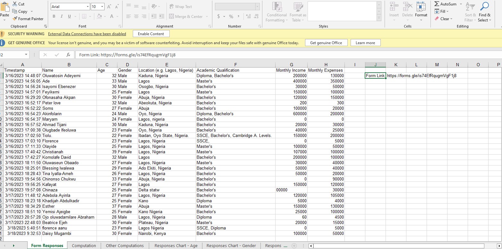
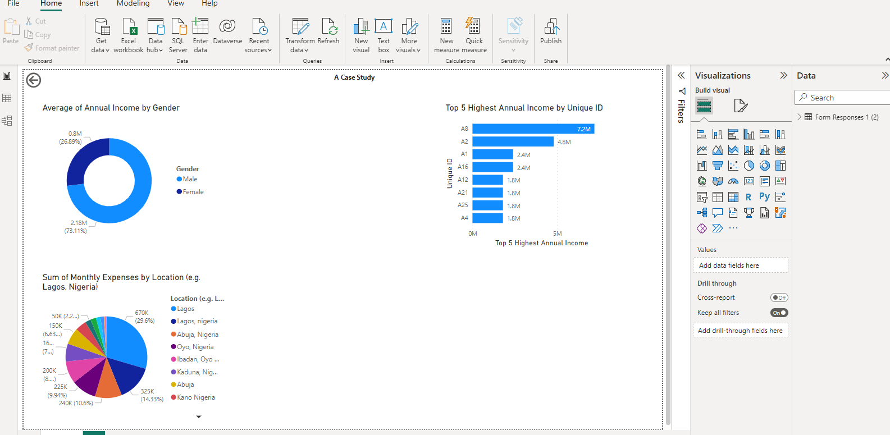

# A-Case-Study

## Introduction
This is a Power BI project on analysis from online survey questionnaires sourced from 30 respondents via Google Form. The project is to analyze and derive insights to answer certain questions.
Survey questions 
- NAME
- AGE 
- GENDER
- LOCATION 
- ACADEMIC QUALIFICATIONS
- ANNUAL INCOME 
- ANNUAL EXPENSES

## Problem Statement
1. What is the average annual income by gender?
2. What is the sum of monthly expenses by Location?
3. What are the top 5 Highest Annual Income?

## Skills/ Concepts demonstrated 
The following Power BI features were incorporated
- Page navigation, 
- Filters, 
- Tooltips, 
- Data label

# Visualization
The report comprises of a page

## Analysis
Average of Annual Income for Male (2175390) was higher than Female (800,181.82).

Lagos accounted for 29.60% of Sum of Monthly Expenses. 

Across all 8 Unique IDs, Top 5 Highest Annual Income ranged from 1800000 to 7200000.

## Conclusion
- Lagos accounted for the highest expenses so we can infer that the standard of living in Lagos is relatively high.  
- We can infer than men earned more, with 1375208.18 Millons than women. 
